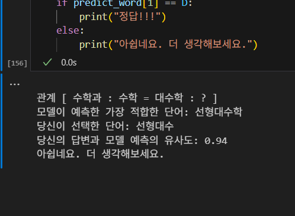
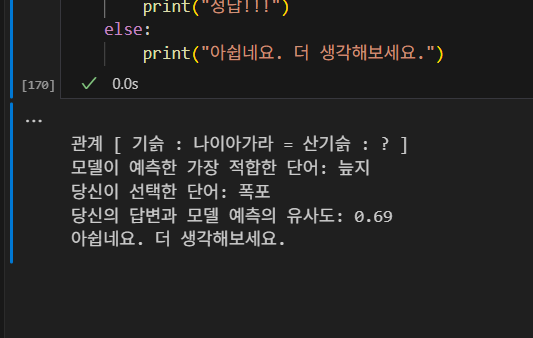

# 🧩유사한 단어 찾기 게임🧩

### 1. 사용한 데이터셋
https://huggingface.co/datasets/HAERAE-HUB/KOREAN-SyntheticText-1.5B

 

### 2. 대응 기준
FastText 임베딩을 활용하여 단어 간 관계를 벡터 공간에서 표현했고, 단어 쌍 (A, B)는 코사인 유사도 0.8 이상인 단어들 중에서 랜덤 추출하였습니다.  
대응 단어 D는 아래의 벡터 연산을 통해 구하였습니다.  
$$vec(D)≈vec(B)−vec(A)+vec(C)$$

 

### 3. 실행 결과 화면
 

